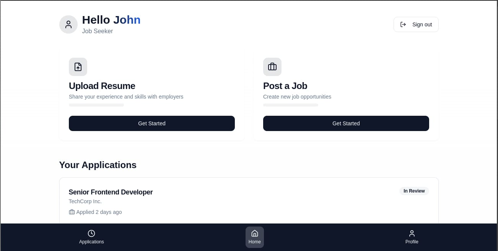

<h1> Seeknconnect - an AI powered job portal</h1>

Where Talent Meets Oppurtunity

## 😓Existing Issues in the Employment Process

* Inefficient and time-consuming
* Prone to bias
* Lack of objective assessment

## 💡Problem Solution
* **AI-powered skills assessment:**  Identifies key strengths and weaknesses.
* **Intelligent matching:**  Connects candidates with best-fit jobs.
* **Efficient shortlisting:**  Streamlines recruiter workflows.
* **Holistic compatibility:**  Measures both hard and soft skills.

## 👀 Visual Demo

<b>Candidate Homepage</b>

## 🤝 Contributors
- [@Snehel Basu](https://github.com/Ricky-790)
- [@Anushree Oraon](https://github.com/Floydscharm)

  <h2 align="center">Made with ❤️ team Diamond Heartz</h2>
